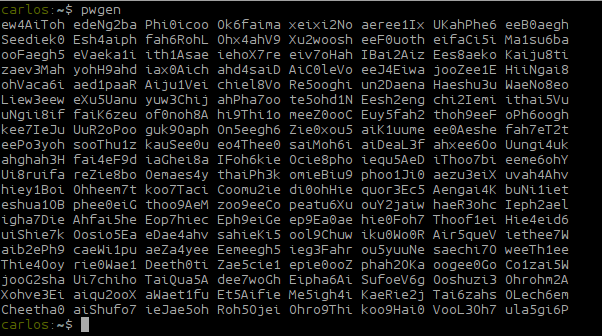
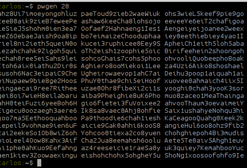
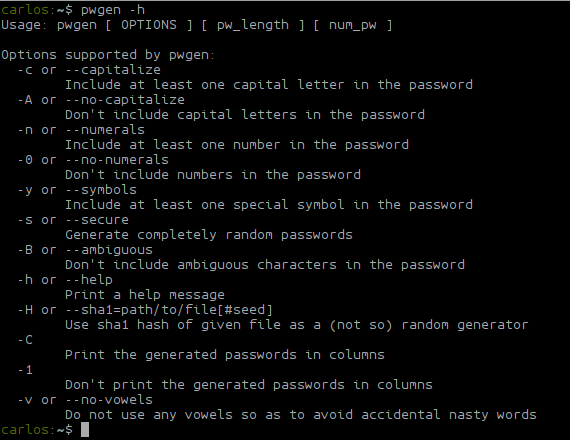

Frequentemente preciso enviar senhas de VPN para clientes, criar ou alterar senhas novas para os servidores.
Existem diversas ferramentas online que isso possa ser feito, mas ao meu ver, o tempo que demoro em acessar essas ferramentas se torna muito grande.
Após algumas pesquisas encontrei um pacote que pode fazer isso pelo terminal.

Para instalar vamos baixar e compilar o pacote.

<!--more-->
Primeiramente vamos baixar o source do pacote

``` bash
    wget http://downloads.sourceforge.net/project/pwgen/pwgen/2.07/pwgen-2.07.tar.gz
```
<br>
Vamos descompactar o arquivo

``` bash
    $ tar xvf pwgen-2.07.tar.gz
    $ cd pwgen-2.07
```

Agora vamos compilar

``` bash
    $ ./configure
    $ make
    $ sudo make install
```

Agora é só usar o comando
``` bash
    $ pwgen
```

Por padrão ele gera uma sequencia de caracteres alfanumericos maiusculos e minusculos e numeros com 8 caracteres. Mas caso queira, você pode definir o tamanho maior para as senhas.


Por exemplo, gerar senhas com 20 caracteres.
``` bash
    $ pwgen 20
```


Você pode gerar senhas de infinitas formas, para isso, basta ler o arquivo helper usando o parametro -h




Simples assim :)
